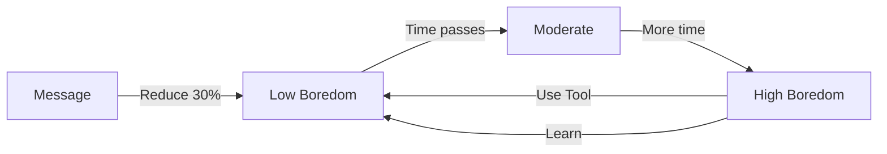

# 🤖 RPI AI Agent

> **Created in collaboration with Antigravity**  
> Powered by Discord, ngrok, and local LLMs.

> Autonomní Discord AI Agent běžící na Raspberry Pi s lokálním LLM

<div align="center">

[](https://discord.com)
[](https://python.org)
[](https://raspberrypi.org)
[](LICENSE)


</div>

---

## 🎯 Co je RPI AI Agent?

<table>
<tr>
<td width="50%">

### 🧠 Inteligence
- **Lokální LLM** Qwen 2.5 (0.5B)
- **Memory Scoring** 70-bodový systém
- **Autonomní učení** Boredom-driven
- **Fuzzy Matching** Auto-korekce příkazů

</td>
<td width="50%">

### ⚡ Výkon
- **Resource Manager** 4-tier adaptivní systém
- **SQLite + FTS5** Full-text search
- **Async Queue** Non-blocking commands
- **WAL Mode** Optimalizovaná DB

</td>
</tr>
<tr>
<td width="50%">

### 🛠️ Nástroje
- Web Search & Scraping
- Math & Time Operations
- Weather & Wikipedia
- File & Git Management

</td>
<td width="50%">

### 💬 Discord
- **24 Příkazů** Basic + Admin
- **Interactive Buttons** Dokumentace UI
- **Live Updates** Real-time monitoring
- **Auto-correction** Typo fixing

</td>
</tr>
</table>

---

## 🚀 Quick Start Guide

<details open>
<summary><b>👨‍💼 Pro Windows Adminy</b></summary>

### 1️⃣ Připojení k RPI

```batch
cd scripts
ssh_connect.bat
```

### 2️⃣ Health Check

```batch
rpi_health_check.bat
```

**Output:**
```
===== RPI HEALTH CHECK =====
Service Status: ● active (running)
CPU: 25% | RAM: 1.2G/3.8G | Disk: 12G/28G
Temperature: temp=48.2'C
Recent Logs: [INFO] Agent running...
```

### 3️⃣ Restart Service

```batch
rpi_restart_service.bat
```

</details>

<details>
<summary><b>👥 Pro Discord Uživatele</b></summary>

### Základní Příkazy

```
!help              # 📋 Zobraz všechny příkazy
!status            # 📊 Stav agenta + diagnostika
!stats             # 📈 Detailní statistiky
!ask <otázka>      # 💬 Zeptej se AI
!teach <info>      # 🎓 Nauč agenta
!docs              # 📚 Interaktivní dokumentace
```

### Příklad Interakce

```
You: !ask počasí Praha

Bot: 🌤️ V Praze je momentálně 8°C, částečně oblačno.
     Vlhkost: 65%, vítr: 12 km/h.
```

</details>

---

## 📚 Dokumentace Navigator

<div align="center">

```
┌─────────────────────────────────────────────────────────┐
│              📚 DOKUMENTAČNÍ ROZCESTNÍK                  │
├─────────────────────────────────────────────────────────┤
│                                                          │
│  🎯 QUICK START                                         │
│  ├─ 📖 OVERVIEW.md ..................... Základy        │
│  ├─ 🚀 deployment-guide.md ............. Setup RPI      │
│  └─ 📜 batch-scripts-reference.md ...... Windows tools  │
│                                                          │
│  💬 PŘÍKAZY (24)                                        │
│  ├─ basic.md ........................... Core funkce    │
│  ├─ tools-learning.md .................. AI & Tools     │
│  ├─ data-management.md ................. Memory & Logs  │
│  └─ admin.md ........................... Admin only     │
│                                                          │
│  🧠 CORE SYSTÉMY (5)                                    │
│  ├─ memory-system.md ⭐ ................ Scoring!       │
│  ├─ autonomous-behavior.md ............. Boredom AI     │
│  ├─ llm-integration.md ................. Qwen 2.5       │
│  └─ resource-manager.md ................ 4-tier system  │
│                                                          │
│  🎓 ADVANCED                                            │
│  ├─ fuzzy-matching-algorithm.md 🔍 ..... Auto-correct   │
│  └─ (více brzy...)                                      │
│                                                          │
└─────────────────────────────────────────────────────────┘
```

</div>

### 📂 Adresářová Struktura

```
documentation/
├── 📖 README.md                 ← Hlavní index
├── 📄 OVERVIEW.md               ← START HERE!
├── 📊 SUMMARY.md                ← Souhrn všech docs
├── 📐 architecture.md
│
├── 💬 commands/                 ← 24 Discord příkazů
│   ├── basic.md                # !help, !status, !stats
│   ├── tools-learning.md       # !learn, !ask, !teach
│   ├── data-management.md      # !memory, !logs, !export
│   ├── interaction.md          # !mood, !goals
│   └── admin.md                # !restart, !debug, !ssh
│
├── 📚 api/                      ← API Reference
│   ├── agent-core.md
│   ├── discord-client.md
│   ├── tools-api.md
│   ├── error-tracker.md        # Error handling
│   └── utils-startup.md        # Startup protection
│
├── 🛠️ tools/                    ← 14 nástrojů
│   └── all-tools.md
│
├── 🧠 core/                     ← Core systémy
│   ├── autonomous-behavior.md
│   ├── memory-system.md        ⭐ SCORING SYSTEM!
│   ├── llm-integration.md
│   ├── resource-manager.md
│   └── discord-client.md
│
├── 📜 scripts/                  ← Deployment
│   ├── deployment-guide.md     🚀 SETUP GUIDE
│   ├── testing-guide.md        # Tests & Verification
│   ├── memory-manager.md       # DB Maintenance
│   └── batch-scripts-reference.md
│
├── 🎓 advanced/
│   └── fuzzy-matching-algorithm.md  🔍 Levenshtein
│
└── ⚙️ configuration/
    ├── models.md               # Local LLM Guide
    └── customization-guide.md
```

---

## 💡 Klíčové Funkce

### 🧠 Memory Scoring System

<table>
<tr>
<td>

**Scoring Pravidla:**
- ✅ **+10** za klíčové slovo
- ✅ **+30** za unikátní obsah  
- ❌ **-20** za error detection
- 🎯 **70** bodů threshold

</td>
<td>

**Příklad:**
```python
Content: "Learned Python programming"

Keywords: +20 (python, programming)
Unique:   +30
Total:    50 pts → ❌ REJECTED

!teach bypass → ✅ SAVED!
```

</td>
</tr>
</table>

> 💡 **!teach příkaz VŽDY uloží** - Bypass scoring systému!

📖 [Memory System Docs](documentation/core/memory-system.md#advanced-scoring-system)

---

### 🔍 Fuzzy Command Matching

Auto-oprava překlepů pomocí **Levenshtein Distance**:

<div align="center">

| Input | Auto-corrected | Distance |
|:-----:|:--------------:|:--------:|
| `!statu` | `!status` | 1 |
| `!hlep` | `!help` | 2 |
| `!toools` | `!tools` | 1 |
| `!rstart` | `!restart` | 1 |

</div>

```
User: !statu

Bot: 💡 Did you mean !status? (auto-correcting '!statu')
     📊 Agent Status
     ✅ Running...
```

📖 [Algoritmus Details](documentation/advanced/fuzzy-matching-algorithm.md)

---

### 🤖 Autonomní Chování

<table>
<tr>
<th>Boredom Level</th>
<th>Agent Akce</th>
</tr>
<tr>
<td><code>0-40%</code> 🟢</td>
<td>Čeká na příkazy, pasivní monitoring</td>
</tr>
<tr>
<td><code>40-70%</code> 🟡</td>
<td>Začíná tool exploration, web search</td>
</tr>
<tr>
<td><code>70-100%</code> 🔴</td>
<td>Aktivní learning, autonomous actions</td>
</tr>
</table>

**Boredom Flow:**



📖 [Autonomous Behavior](documentation/core/autonomous-behavior.md)

---

## 🔧 Maintenance Scripts

### 📊 Denní Kontrola

```batch
scripts\rpi_health_check.bat
```

<details>
<summary><b>Output Preview</b></summary>

```
═════════════════════════════════════
       RPI AI AGENT - HEALTH CHECK
═════════════════════════════════════

🟢 SERVICE STATUS
   ● rpi-agent.service - ACTIVE (running)
   Uptime: 2 days, 5 hours

📊 RESOURCES
   CPU:  ████░░░░░░ 38%
   RAM:  ██████░░░░ 58% (2.2G / 3.8G)
   Disk: ███░░░░░░░ 28% (12G free)
   Swap: ██░░░░░░░░ 15%

🌡️  TEMPERATURE
   temp=52.8'C

📝 RECENT LOGS (Last 10)
   [INFO] Boredom: 34%
   [INFO] Tool used: web_tool
   [INFO] Memory saved: "User taught me..."

═════════════════════════════════════
Status: ✅ ALL SYSTEMS OPERATIONAL
═════════════════════════════════════
```

</details>

### 🛠️ Maintenance Table

<div align="center">

| Script | Use Case | Frequency | Risk |
|:------:|:--------:|:---------:|:----:|
| 🔄 `rpi_restart_service.bat` | After code update | As needed | 🟢 |
| 🧹 `rpi_cleanup_logs.bat` | Logs > 50 MB | Weekly | 🟡 |
| 💾 `rpi_cleanup_memory.bat` | DB > 10 MB | Monthly | 🟡 |
| 🔧 `rpi_fix_llm.bat` | LLM won't load | Rarely | 🟡 |
| ⚙️ `rpi_setup_swap.bat` | Initial setup | **ONCE** | 🔴 |

</div>

📖 [Complete Scripts Reference](documentation/scripts/batch-scripts-reference.md)

---

## 📊 Statistiky & Metriky

<div align="center">

### 📈 Project Stats


### 🎯 Intelligence Metrics

```
╔═══════════════════════════════════════════════════╗
║         INTELLIGENCE SCORING (0-1000)             ║
╠═══════════════════════════════════════════════════╣
║                                                   ║
║  🛠️  Tool Diversity      max 500 pts             ║
║      log(tools + 1) × 120                         ║
║                                                   ║
║  ⚡ Usage Efficiency    max 300 pts              ║
║      log(uses + 1) × 100                          ║
║                                                   ║
║  🎓 Learnings           max 200 pts              ║
║      log(learns + 1) × 45                         ║
║                                                   ║
╚═══════════════════════════════════════════════════╝
```

</div>

---

## 🎨 Discord UI Preview

### !documentation Command

```
┌─────────────────────────────────────────┐
│      📚 AI Agent Dokumentace            │
├─────────────────────────────────────────┤
│                                         │
│  📖 Overview                            │
│  Základní přehled systému...            │
│                                         │
│  💬 Commands                            │
│  Seznam všech 24 příkazů...             │
│                                         │
│  🛠️ Tools                               │
│  Detailní popis 14 nástrojů...          │
│                                         │
│  🧠 Core                                │
│  Memory, LLM, Resources...              │
│                                         │
│  📜 Scripts                             │
│  Deployment + Batch scripts...          │
│                                         │
│  🎓 Advanced                            │
│  Fuzzy matching, Queue system...        │
│                                         │
├─────────────────────────────────────────┤
│ [📖 Overview] [💬 Commands] [🛠️ Tools] │
│ [🧠 Core] [📜 Scripts] [🎓 Advanced]   │
└─────────────────────────────────────────┘
```

---

## ⚙️ Configuration Quick Guide

### 🔧 Initial Setup Checklist

- [ ] **1. Clone Project**
  ```bash
  git clone <repo-url>
  cd rpi_ai/rpi_ai
  ```

- [ ] **2. Configure IP Addresses**
  ```batch
  # Edit ALL .bat files in scripts/
  set RPI_HOST=192.168.1.100  ← YOUR RPI IP
  ```

- [ ] **3. Test SSH Connection**
  ```batch
  scripts\ssh_connect.bat
  ```

- [ ] **4. Setup SWAP (ONCE!)**
  ```batch
  scripts\rpi_setup_swap.bat
  ```

---

## 🆘 Troubleshooting

<details>
<summary><b>❌ Agent se nespustí</b></summary>

```bash
# 1. Check service status
sudo systemctl status rpi-agent.service

# 2. View logs
sudo journalctl -u rpi-agent.service -n 50

# 3. Restart service
sudo systemctl restart rpi-agent.service
```

</details>

<details>
<summary><b>🧠 LLM se nenačte</b></summary>

**Symptom:** `LLM not available` errors

**Fix:**
```batch
# Windows
scripts\rpi_fix_llm.bat

# Or manually on RPI
cd ~/rpi_ai/rpi_ai
python3 scripts/fix_llm_full.py
```

</details>

<details>
<summary><b>💾 Database Corruption</b></summary>

```bash
# 1. Backup current
cp agent_memory.db agent_memory.db.corrupted

# 2. Restore from backup
cp backup/agent_memory_<date>.db agent_memory.db

# 3. Restart
sudo systemctl restart rpi-agent.service
```

</details>

<details>
<summary><b>📊 High Resource Usage</b></summary>

**Discord Commands:**
```
!monitor        # Check current usage
!debug quick    # Diagnostic info
```

**If RAM > 90%:**
- Agent auto-reduces LLM context window
- Check for memory leaks in logs
- Consider cleanup: `rpi_cleanup_memory.bat`

</details>

📖 [Complete Troubleshooting Guide](documentation/scripts/deployment-guide.md#troubleshooting)

---

## 📝 Changelog

<details open>
<summary><b>v1.2.0 (2025-12-06)</b> - Beta CLOSED</summary>

#### ⭐ New Features
- **Project Structure Optimization** - Enhanced documentation and gitignore
- **Security Updates** - Removed sensitive documentation
- **Memory Scoring System** - Pokročilé 70-bodové filtrování
- **Fuzzy Command Matching** - Auto-korekce překlepů (Levenshtein)
- **!documentation UI** - Interactive button navigation
- **Advanced Topics Section** - Algoritmy a deep dives

#### 📚 Documentation
- **17 Documentation Files** (+3) - 150 KB total
- **Scripts Documentation** - Deployment + Batch reference
- **Memory Scoring Docs** - Complete implementation guide
- **Fuzzy Matching Algo** - Full algorithm explanation

#### 🔧 Important Changes
- `!teach` bypass documented - Always saves
- Commands count: 21 → 24
- SUMMARY.md updated with all changes

</details>

<details>
<summary><b>v1.0.0 (2025-12-02)</b> - Initial Release</summary>

- 🤖 Autonomous behavior with boredom system
- 💾 SQLite + FTS5 memory system
- 🛠️ 14 built-in tools
- 📊 4-tier resource management
- 💬 24 Discord commands
- 🧠 Local LLM (Qwen 2.5)

</details>

---

## 🎯 Feature Roadmap

- [ ] **Command Queue Internals** - Detailed documentation
- [ ] **Learning Mode Deep Dive** - How agent learns
- [ ] **Boredom Mechanism** - Detailed behavior analysis
- [ ] **API Reference** - Complete class documentation
- [ ] **More Tools** - Expanded functionality

📖 [See Full Roadmap](documentation/SUMMARY.md#📈-další-kroky-volitelné)

---

## 📄 License

```
MIT License

Copyright (c) 2025 RPI AI Agent Project

Permission is hereby granted, free of charge, to any person obtaining a copy
of this software and associated documentation files (the "Software"), to deal
in the Software without restriction...
```

**Full License:** [LICENSE](LICENSE)

---

## 👤 Author & Contact

**RPI AI Agent Project**  
Autonomous Discord Bot for Raspberry Pi

- 📚 **Documentation:** [documentation/](documentation/)
- 🚀 **Deployment:** [deployment-guide.md](documentation/scripts/deployment-guide.md)
- 💬 **Discord:** Use `!docs` for interactive help
- 📜 **Scripts:** [batch-scripts-reference.md](documentation/scripts/batch-scripts-reference.md)

---

<div align="center">

### 🌟 Quick Actions

[](documentation/)
[](documentation/scripts/deployment-guide.md)
[](documentation/scripts/batch-scripts-reference.md)

---

**Last Updated:** 2025-12-06  
**Version:** Beta - CLOSED  
**Status:** ✅ Production Ready

Made with ❤️ for Raspberry Pi

</div>
